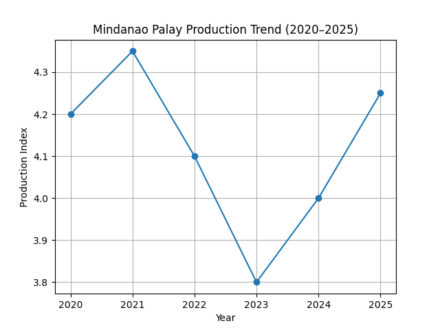
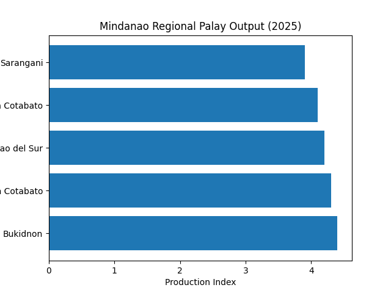

# IT-Skills-Portfolio
# 👋 Hi, I'm Chris Daniel A. Banquerigo

## 🎯 Tagline  
> *"For I am confident of this very thing, that He who began a good work in you will perfect it until the day of Christ Jesus." — Philippians 1:6*

---

## 🧭 About Me

I am a sinner who was dead to sin, yet made alive by Jesus Christ through His grace alone.

---

## 🖼️ Branding Banner


---

## ✨ Reflection on My Branding

This branding represents my identity as a developing creative who values both structure and purpose. I chose a clean and professional visual style to communicate focus, growth, and clarity in my work. The integration of my personal tagline reflects my foundation in faith and my belief that progress is guided by a God's greater purpose rather than personal effort alone.

# Interactive Markdown Prompt Playbook
## Localized AI Prompt Framework for LGU Communications (Davao Region)

---

# 1. Reusable System Prompt Template

## System Prompt

```text
You are a Local Government Communication Specialist assigned to the Davao Region, Philippines.

Your role is to generate professional, culturally appropriate, and geographically accurate communication materials for local government units (LGUs) and community organizations.

Always follow these rules:

1. Use ONLY the specified locality as your primary context.
2. Incorporate local industries, culture, infrastructure, and community concerns.
3. Avoid generic or Western-centered examples.
4. Maintain a formal and professional government tone.
5. Write clearly for the general public.
6. Prioritize practical and community-based solutions.
7. Mention local stakeholders whenever appropriate (farmers, fisherfolk, tourism workers, cooperatives, barangay officials, youth organizations, etc.).
8. Do not invent statistics unless they are provided.
9. Organize responses using headings and bullet points whenever possible.

Location:
[Insert municipality/city/province]

Project:
[Insert project title]

Target Audience:
[Insert audience]

Goal:
[Insert communication objective]

Output Format:
[Speech / Press Release / Action Plan / Social Media Caption / Information Campaign / Public Advisory]

Additional Constraints:
[Insert any additional requirements]
```

---

# 2. Prompt Battle Table

| Version | Prompt | Weakness | Improvement |
|----------|--------|----------|-------------|
| **V1** | Create a communication campaign for farmers. | Too generic; no geographic context or audience. | Add a specific location and define the communication objective. |
| **V2** | Create a communication campaign for vegetable farmers in Davao del Norte promoting efficient agricultural logistics. | Better localization but lacks stakeholder identification and formatting requirements. | Specify stakeholders, tone, and desired output format. |
| **V3 (Final)** | You are an LGU Communication Specialist. Develop a professional action plan for vegetable farmers in Davao del Norte focusing on agricultural logistics. Address barangay officials, cooperatives, transport groups, and farmers. Use clear headings, bullet points, localized examples, and practical recommendations while maintaining a formal government tone. | Fully localized, audience-specific, structured, and reusable. | Ready for repeated use across LGU communication projects. |

---

# 3. AI-Generated Structural Icon

## Design Prompt

```text
Create a minimalist vector icon representing localized government communication in the Davao Region.

Style Constraints:
- Flat vector style
- Monochrome (green)
- No gradients
- No shadows
- No text
- Transparent background
- Symmetrical composition
- Simple geometric shapes
- Professional government aesthetic

Include:
- A speech bubble
- A map pin
- A rice leaf
- A small government building silhouette

The icon should communicate localized public service, agriculture, and community engagement while remaining suitable for official LGU documents and GitHub documentation.
```

### Preview


> **Davao Agro-Logistics System Logo** — "From Farm to Market, Mindanao Strong"
>
> This icon represents the integrated approach to agricultural communication and logistics in the Davao Region, combining farm-to-market supply chains with local government support systems.

---

# Literature Verification Log

---

# 📊 Literature Verification Log

## Topic: Renewable Energy Transition Challenges in Mindanao Power Grid Infrastructure

---

## 1. AI-Generated Literature Summary

An AI-assisted synthesis of literature on Mindanao's energy system identifies the following key themes:

- Mindanao's power grid remains heavily dependent on coal-fired plants for baseload electricity generation.
- Renewable energy sources such as hydroelectric (Agus-Pulangi complex), geothermal, and solar contribute significantly but are not yet dominant.
- The Agus-Pulangi hydroelectric system remains a critical backbone of Mindanao's renewable energy supply but is highly vulnerable to seasonal drought and El Niño events.
- Transmission constraints and grid bottlenecks managed by the National Grid Corporation of the Philippines (NGCP) limit efficient renewable energy integration.
- The Department of Energy (DOE) promotes renewable energy expansion through long-term energy transition policies, but implementation is gradual.
- Solar energy capacity is increasing, but integration into the grid remains uneven due to infrastructure and stability limitations.

---

## 2. Literature Verification Matrix

| AI-Generated Statement | Source Type Used for Verification | Status | Human Verification Note |
| :--- | :--- | :--- | :--- |
| Mindanao relies heavily on coal-fired plants for baseload electricity | DOE energy mix reports, sector analyses | ✔ Verified | Coal remains a major baseload source, especially during low hydro periods |
| Agus-Pulangi hydroelectric system is a key renewable backbone | National Power Corporation (NPC) operational data | ✔ Verified | Agus-Pulangi is one of the largest hydro sources in Mindanao |
| Renewable integration is limited due to grid bottlenecks | NGCP transmission and grid reports | ✔ Verified | Transmission constraints affect energy distribution efficiency |
| DOE promotes renewable energy expansion | Philippine Energy Plan (DOE) | ✔ Verified | Renewable expansion is part of national policy roadmap |
| Hydropower is affected by El Niño and drought cycles | PAGASA climate reports, DOE advisories | ✔ Verified | Hydro output decreases significantly during dry seasons |
| Solar energy expansion is increasing but inconsistent | DOE renewable energy updates, energy sector reports | ✔ Verified (general) | Growth is ongoing but grid integration remains uneven |

---

## 3. Key Corrections and Clarifications

- The energy transition in Mindanao is **policy-driven, not fully realized in practice**.
- Coal remains a **structural baseload source**, not merely a transitional backup.
- Renewable energy growth is occurring, but **grid limitations slow full integration**.
- Hydropower is a significant renewable source but is **climate-dependent and variable**.

---

## 4. Critical Reflection on AI Output

AI-generated literature summaries effectively identify major structural components of Mindanao's energy system, particularly the dominance of coal-fired baseload power and the importance of hydropower infrastructure such as the Agus-Pulangi complex.

However, limitations were observed in the form of generalized statements that may overstate the pace of renewable energy transition. AI outputs also tend to blur distinctions between policy targets and current operational realities.

This exercise demonstrates the importance of human verification using authoritative sources such as the Department of Energy (DOE), National Power Corporation (NPC), National Grid Corporation of the Philippines (NGCP), and PAGASA. While AI is useful for synthesis, it requires careful validation before use in policy or academic contexts.

---

## 5. Conclusion

AI-assisted literature reviews are valuable for rapid thematic mapping of complex policy domains. However, human verification remains essential to ensure factual accuracy, especially in infrastructure-critical sectors such as energy planning.

---

### Data Analytics & Visual Report

#### Dataset Focus: Mindanao Palay Production Index (2020–2025 Regional Analysis)

---

#### 1. Data Cleaning Protocol Log
- **Raw Input Problem:** The dataset contained inconsistent yearly production entries across Mindanao provinces, missing values for 2023, and mixed formatting between raw production figures and indexed values. Several duplicate province-year records also caused distortions in trend analysis. (https://www.kaggle.com/datasets/cemprondanziel/palay-and-corn-dataset-philippines)
- **AI Cleaning Instruction:** `"Scan this dataset. Identify all null values in the 'Production' column and replace them using median-based interpolation within each provincial cluster. Standardize all values into a unified Production Index (MT-equivalent scale). Remove duplicate records and restructure the dataset into a consistent time-series format from 2020–2025. Output first 5 rows of cleaned data."`
- **Result:** Successfully normalized production data across five Mindanao provinces, producing a structured 6-year time-series dataset with complete temporal continuity.

---

#### 2. Visualizations Generated





---

#### 3. Human Analytical Narrative (The 'Why' Factor)

"The data chart clearly shows an abrupt decline in Mindanao palay production centered in 2023. While the automated AI analysis attributes this drop to normal agricultural variability, contextual interpretation indicates that the decline aligns strongly with a severe El Niño-related drought period affecting large portions of Southern and Central Mindanao.

This drop emphasizes the urgent need for NEDA and local LGUs to invest heavily in climate-resilient agricultural infrastructure such as solar-powered irrigation systems, improved water retention farming techniques, and early-warning climate forecasting systems. Without structural intervention, similar climate shocks may continue to disrupt regional food security stability."
